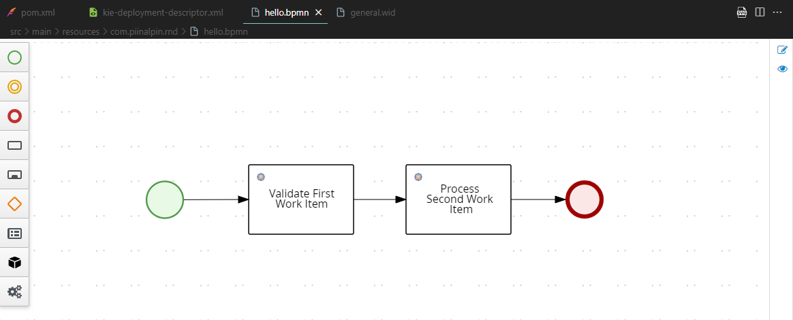
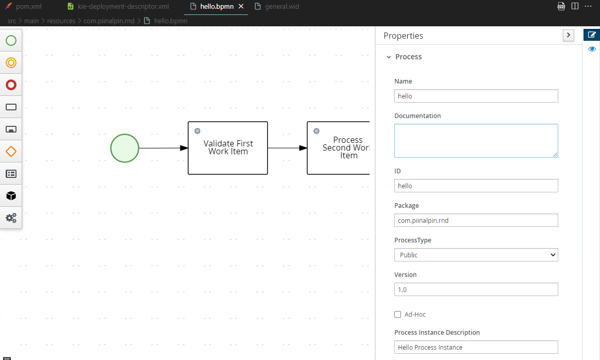
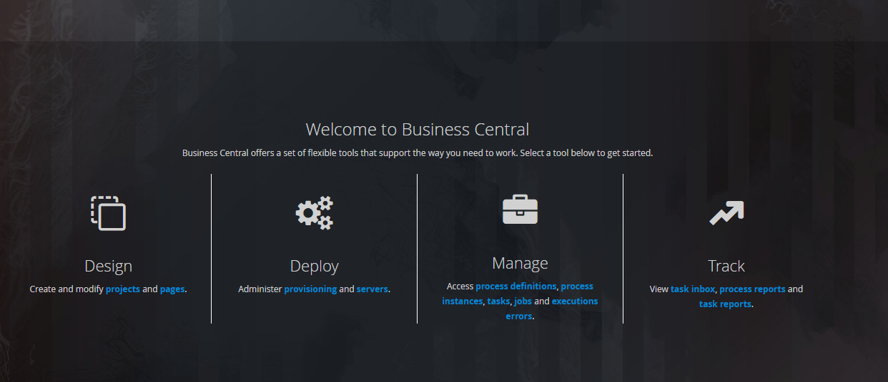
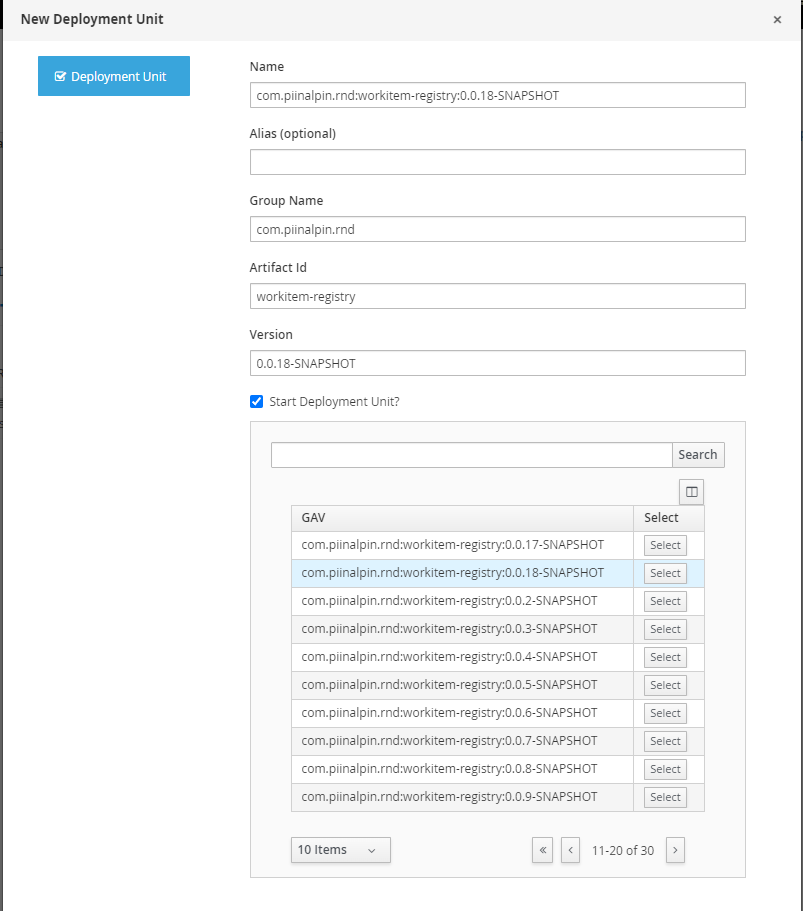

# Spring Boot jBPM Integration
**jBPM** is a toolkit for building business applications to help automate business processes and decisions.

jBPM originates from BPM (Business Process Management) but it has evolved to enable users to pick their own path in business automation. It provides various capabilities that simplify and externalize business logic into reusable assets such as cases, processes, decision tables and more.

- business processes (BPMN2)
- case management (BPMN2 and CMMN)
- decision management (DMN)
- business rules (DRL)
- business optimisation (Solver)

jBPM can be used as standalone service or embedded in custom service. It does not mandate any of the frameworks to be used, it can be successfully used in

- traditional JEE applications - war/ear deployments
- SpringBoot or Thorntail (formerly known as WildFly Swarm) - uberjar deployments
- standalone java programs

<p class="" align="center">
  
</p>

**Prerequisities**
- Intelij IDEA
- VSCode + BPMN Editor (Extension)
- Java 11
- Jboss Business Central 7.73.0.Final [download here](https://download.jboss.org/jbpm/release/7.73.0.Final/jbpm-server-7.73.0.Final-dist.zip)

### Kie Server

First thing, we need add dependency `pom.xml` like below.
```xml
<dependency>
  <groupId>org.springframework.boot</groupId>
  <artifactId>spring-boot-starter-web</artifactId>
</dependency>

<dependency>
  <groupId>org.springframework.boot</groupId>
  <artifactId>spring-boot-starter-data-jpa</artifactId>
</dependency>

<dependency>
  <groupId>org.kie</groupId>
  <artifactId>kie-server-spring-boot-starter</artifactId>
  <version>7.73.0.Final</version>
</dependency>

<dependency>
  <groupId>org.osgi</groupId>
  <artifactId>osgi.core</artifactId>
  <version>8.0.0</version>
  <scope>provided</scope>
</dependency>

<dependency>
  <groupId>org.jbpm</groupId>
  <artifactId>jbpm-workitems-core</artifactId>
  <version>7.73.0.Final</version>
  <scope>provided</scope>
</dependency>

<dependency>
  <groupId>org.projectlombok</groupId>
  <artifactId>lombok</artifactId>
  <version>1.18.24</version>
  <scope>provided</scope>
</dependency>

<dependency>
  <groupId>com.h2database</groupId>
  <artifactId>h2</artifactId>
  <scope>runtime</scope>
</dependency>

<dependency>
  <groupId>org.springframework.boot</groupId>
  <artifactId>spring-boot-starter-test</artifactId>
  <scope>test</scope>
</dependency>
```

Modify the `application.properties` to like this.
```env
server.port=8081
spring.application.name=workflow
server.servlet.context-path=/api/${spring.application.name}

cxf.path=/rest
jbpm.container.alias=workitem-registry

spring.datasource.url=jdbc:h2:mem:testdb;DB_CLOSE_DELAY=-1;DB_CLOSE_ON_EXIT=false;MODE=MYSQL
spring.datasource.driverClassName=org.h2.Driver
spring.datasource.username=sa
spring.datasource.password=password
spring.jpa.database-platform=org.hibernate.dialect.H2Dialect
spring.jpa.hibernate.ddl-auto=update
spring.jpa.properties.hibernate.hbm2ddl.auto=update
spring.jpa.hibernate.naming.physical-strategy=org.hibernate.boot.model.naming.PhysicalNamingStrategyStandardImpl

kieserver.serverId=workitem-service-kie-server
kieserver.serverName=workitem-service-kie-server
kieserver.location=http://localhost:8081${server.servlet.context-path}/rest/server
kieserver.controllers=http://localhost:8080/business-central/rest/controller
kieserver.drools.enabled=true
kieserver.dmn.enabled=true
kieserver.jbpm.enabled=true
kieserver.jbpmui.enabled=true
kieserver.casemgmt.enabled=true
jbpm.executor.enabled=false
```

Since `kie-server-spring-boot-starter` package is included with spring security, we need to by pass all request. Create `CustomSecurityConfig.java`

```java
@Order(1)
@Configuration
@EnableWebSecurity
public class CustomSecurityConfig extends WebSecurityConfigurerAdapter {

    @Override
    protected void configure(HttpSecurity http) throws Exception {
            http.csrf().disable()
                .authorizeRequests()
                .anyRequest().permitAll();
    }
}
```

Yeah, of course we also need pojo class `WorkflowDto.java`.
```java
@Data
@Builder
@NoArgsConstructor
@AllArgsConstructor
public class WorkflowDto {

    private String status;
    private String message;
    private ProcessInstanceDesc processInstance;

}
```

We will create 2 work item handler which is will be executed from `business-central`.

**FirstWorkItemHandler**
```java
@Slf4j
@Component("FirstWorkItemHandler")
public class FirstWorkItemHandler implements WorkItemHandler {
    @Override
    public void executeWorkItem(WorkItem workItem, WorkItemManager workItemManager) {
        log.info("Executing work item = [FirstWorkItemHandler]");
        workItemManager.completeWorkItem(workItem.getId(), null);
    }

    @Override
    public void abortWorkItem(WorkItem workItem, WorkItemManager workItemManager) {
        log.info("Aborting work item = [FirstWorkItemHandler]");
        workItemManager.abortWorkItem(workItem.getId());
    }

}
```

and **SecondWorkItemHandler**
```java
@Slf4j
@Component("SecondWorkItemHandler")
public class SecondWorkItemHandler implements WorkItemHandler {
    @Override
    public void executeWorkItem(WorkItem workItem, WorkItemManager workItemManager) {
        log.info("Executing work item = [SecondWorkItemHandler]");
        workItemManager.completeWorkItem(workItem.getId(), null);
    }

    @Override
    public void abortWorkItem(WorkItem workItem, WorkItemManager workItemManager) {
        log.info("Aborting work item = [SecondWorkItemHandler]");
        workItemManager.abortWorkItem(workItem.getId());
    }
}
```

For test api, we will create the controller to trigger workflow.
```java
@Slf4j
@RestController
@RequestMapping(value = "/process")
public class WorkflowController {

    private final ProcessService processService;
    private final ContainerAliasResolver containerAliasResolver;
    private final RuntimeDataService runtimeDataService;

    @Value("${jbpm.container.alias}")
    private String alias;

    public WorkflowController(ProcessService processService, ContainerAliasResolver containerAliasResolver, RuntimeDataService runtimeDataService) {
        this.processService = processService;
        this.containerAliasResolver = containerAliasResolver;
        this.runtimeDataService = runtimeDataService;
    }

    @GetMapping("/{processId}/execute")
    public ResponseEntity<WorkflowDto> executeWorkflow(@PathVariable String processId) {
        log.info("REST execute workflow");
        String containerId = containerAliasResolver.latest(alias);
        log.info("Create process instance :: [{} | {}]", containerId, processId);

        Long processInstanceId = processService.startProcess(containerId, processId);
        ProcessInstanceDesc processInstance = runtimeDataService.getProcessInstanceById(processInstanceId);
        return ResponseEntity.ok(WorkflowDto.builder()
                        .status("00")
                        .message("Success")
                        .processInstance(processInstance)
                .build());
    }

}
```

### Business Process Management (BPM)
In this section we will create custom `WorkItemHanler` based on our project before, which is `FirstWorkItemHandler` and `SecondWorkItemHandler`. First, we need initialize project as maven project with structure like below.

```
.
├── src
│   └── main/
│   ├   ├── reources/
│   ├   ├   └── com/
│   └   ├   ├   └── piinalpin/
│   ├   ├   ├   ├   └── rnd/
│   ├   ├   ├   ├   ├   └── general.wid
│   ├   ├   ├   ├   ├   └── hello-svg.svg
│   └── └── └── └── └── └── hello.bpmn
│   ├   ├   └── META-INF/
│   ├   ├   ├   └── kie-deployment-descriptor.xml 
│   └── └── └── └── kmodule.xml
└── target/
└── pom.xml
└── settings.xml
```

Create `pom.xml` file below.
```xml
<?xml version="1.0" encoding="UTF-8"?>
<project xmlns="http://maven.apache.org/POM/4.0.0" xmlns:xsi="http://www.w3.org/2001/XMLSchema-instance"
	xsi:schemaLocation="http://maven.apache.org/POM/4.0.0 https://maven.apache.org/xsd/maven-4.0.0.xsd">
	<modelVersion>4.0.0</modelVersion>
	<groupId>com.piinalpin.rnd</groupId>
	<artifactId>workitem-registry</artifactId>
	<version>0.0.1-SNAPSHOT</version>
	<name>${project.artifactId}</name>
	<description>Demo project for KJar</description>
	<packaging>kjar</packaging>
	<dependencies>
		<dependency>
			<groupId>org.kie</groupId>
			<artifactId>kie-api</artifactId>
			<version>7.73.0.Final</version>
		</dependency>

		<dependency>
			<groupId>org.kie</groupId>
			<artifactId>kie-internal</artifactId>
			<version>7.73.0.Final</version>
			<scope>provided</scope>
		</dependency>

	</dependencies>

	<distributionManagement>
    <repository>
      <id>jbpm-workbench-repo</id>
      <name>JBPM Workbench Repo</name>
      <url>http://localhost:8080/business-central/maven2/</url>
		</repository>
	</distributionManagement>

	<build>
		<plugins>
			<plugin>
        <groupId>org.kie</groupId>
          <artifactId>kie-maven-plugin</artifactId>
          <version>7.73.0.Final</version>
          <extensions>true</extensions>
      </plugin>
		</plugins>
	</build>

</project>

```

Create `settings.xml` to store the credential from jbpm server to deploy our workflow.
```xml
<?xml version="1.0" encoding="UTF-8"?>
<settings xmlns:xsi="http://www.w3.org/2001/XMLSchema-instance"
          xsi:schemaLocation="http://maven.apache.org/SETTINGS/1.1.0 http://maven.apache.org/xsd/settings-1.1.0.xsd"
          xmlns="http://maven.apache.org/SETTINGS/1.1.0">
    <servers>
        <server>
            <id>jbpm-workbench-repo</id>
            <username>wbadmin</username>
            <password>wbadmin</password>
        </server>
    </servers>
</settings>
```

And we need define the **Work Item Definition** named `WID` file under `src/main/resources` directory.

Create `general.wid`, **name must be same with work item java class**
```wid
[
    [
        "name" : "FirstWorkItemHandler",  
        "displayName" : "Validate First Work Item", 
        "category" : "General",
        "icon" : "defaultservicenodeicon.png",
    ],
    [
        "name" : "SecondWorkItemHandler",  
        "displayName" : "Process Second Work Item", 
        "category" : "General",
        "icon" : "defaultservicenodeicon.png",
    ],
]
```

Create `kmodule.xml` under `src/main/resources/META-INF`
```xml
<kmodule xmlns="http://www.drools.org/xsd/kmodule" xmlns:xsi="http://www.w3.org/2001/XMLSchema-instance"/>
```

Create `kie-deployment-descriptor.xml` under `src/main/resources/META-INF`. **Note:** `identifier` and `name` must be same with work item handler on java class.
```xml
<?xml version="1.0" encoding="UTF-8" standalone="yes"?>
<deployment-descriptor xmlns:xsi="http://www.w3.org/2001/XMLSchema-instance" xsi:schemaLocation="">

    <runtime-strategy>PER_PROCESS_INSTANCE</runtime-strategy>
    <work-item-handlers>
        <work-item-handler>
            <resolver>mvel</resolver>
            <identifier>new com.piinalpin.rnd.workitemservice.handler.FirstWorkItemHandler()</identifier>
            <parameters/>
            <name>FirstWorkItemHandler</name>
        </work-item-handler>
        <work-item-handler>
            <resolver>mvel</resolver>
            <identifier>new com.piinalpin.rnd.workitemservice.handler.SecondWorkItemHandler()</identifier>
            <parameters/>
            <name>SecondWorkItemHandler</name>
        </work-item-handler>
    </work-item-handlers>

</deployment-descriptor>
```

Now, we can draw the workflow. Use `BPMN Editor` from VSCode extension, and draw using `hello.bpmn` workflow like below.



And configure BPMN properties like below. Then find `svg` icon on the top right to generate `hello-svg.svg` file.


Run the jbpm server, if use windows can double click `./bin/standalone.bat` or if use unix system can execute the `./bin/standalone.sh` file.

After JBPM is running, we can deploy our kJar module.
```bash
mvn clean package && mvn deploy --settings=settings.xml
```

### Run Application
We can run our `kie-server` application by execute `mvn spring:boot run`. Then we add deployment unit our kJar into our application.

Go to `http://localhost:8080/business-central/kie-wb.jsp` and login with the default user from jbpm server.
```bash
user: wbadmin
password: wbadmin
```
<br/>

Will be redirect to main page and choose **Deploy** menu. Choose our `kie-server` and add deployment unit.


<br/>

Find our latest version for kJar module.



Then we call trigger API from postman or can directly from browser on this url `http://localhost:8081/api/workflow/process/hello/execute`. And we will got this response.
```json
{
    "status": "00",
    "message": "Success",
    "processInstance": {
        "id": 1,
        "processId": "hello",
        "processName": "hello",
        "processVersion": "1.0",
        "state": 2,
        "deploymentId": "com.piinalpin.rnd:workitem-registry:0.0.18-SNAPSHOT",
        "initiator": "anonymousUser",
        "dataTimeStamp": "2023-12-09T19:02:37.020+00:00",
        "processInstanceDescription": "Hello Process Instance",
        "correlationKey": "1",
        "parentId": -1,
        "slaDueDate": null,
        "slaCompliance": 0,
        "activeTasks": []
    }
}

```

And for log, we can see the `FirstWorkItemHandler` and `SecondWorkItemHandler` already executed.
```log
2023-12-10 02:06:10.530  INFO 35284 --- [nio-8081-exec-3] c.p.r.w.controller.WorkflowController    : REST execute workflow
2023-12-10 02:06:10.531  INFO 35284 --- [nio-8081-exec-3] c.p.r.w.controller.WorkflowController    : Create process instance :: [com.piinalpin.rnd:workitem-registry:0.0.18-SNAPSHOT | hello]
2023-12-10 02:06:10.704  INFO 35284 --- [nio-8081-exec-3] c.p.r.w.handler.FirstWorkItemHandler     : Executing work item = [FirstWorkItemHandler]
2023-12-10 02:06:10.706  INFO 35284 --- [nio-8081-exec-3] c.p.r.w.handler.SecondWorkItemHandler    : Executing work item = [SecondWorkItemHandler]
```

### Conclusion
This is how we can introduce the BPM system using java Spring Boot implementation - **jBPM**. This was an example to demonstrate how we can define workflow and understanding work item handler.

### References
- [A Guide to jBPM with Java](https://www.baeldung.com/jbpm-java)
- [How to create a custom WorkItem Handler in jBPM](https://www.mastertheboss.com/bpm/jbpm6/how-to-create-a-custom-workitem-handler-in-jbpm/)
- [JBPM 7 using a Custom WorkItemHandler](https://github.com/fmarchioni/mastertheboss/tree/master/jbpm/custom-wih)