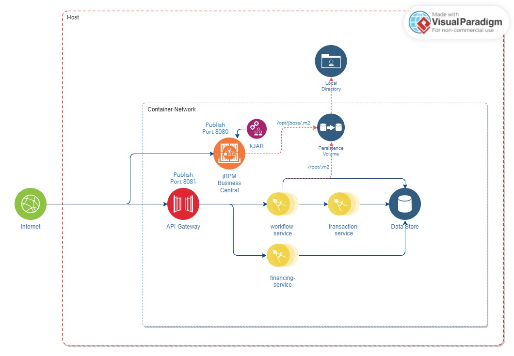
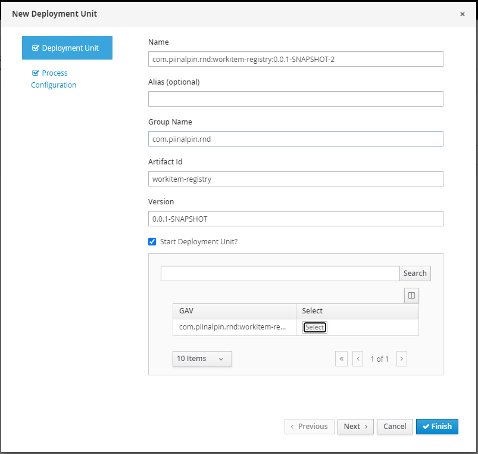
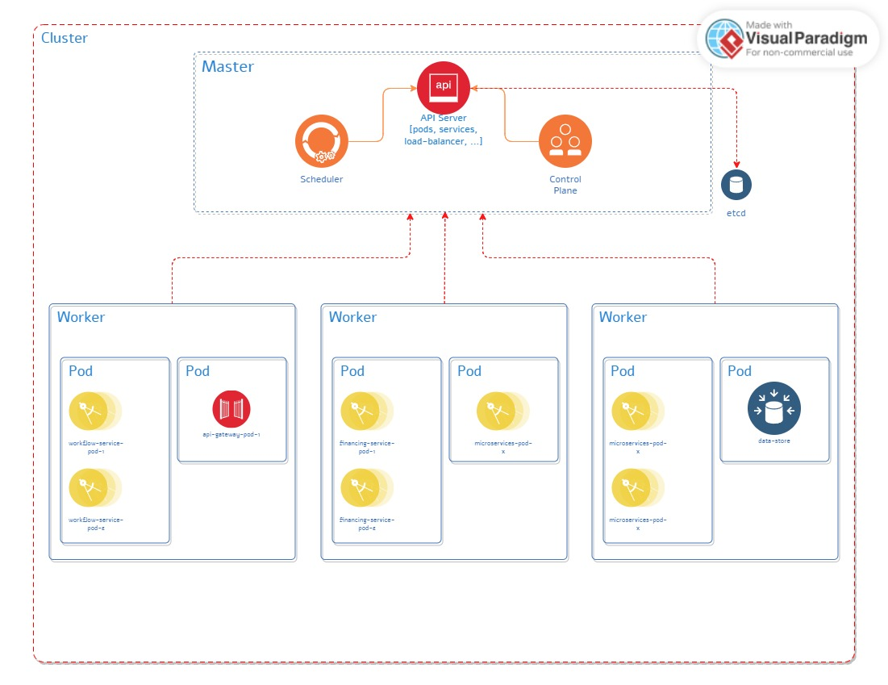

# jBPM Spring Boot Microservices Integration
How to integrate Spring Boot microservices with jBPM and implements containerized architecture

## Containerized Architecture
This sample will use persistence volume to sharing volume between `jBPM server` and `workitem-service`



## How to Run?

Use `docker compose`
```bash
docker compose -p spring-boot-jbpm up -d
```

Go to `workitem-registry` directory and deploy `kJAR` to `jbpm-server`.
```bash
mvn clean package && mvn deploy --settings=settings.xml
```

Add deployment unit `kJAR` to kie server on this example using `workflow-service`



To stop use `docker compose`
```bash
docker compose -p spring-boot-jbpm down -v
```

Remove all generated images
```bash
docker rmi api-gateway-service
docker rmi financing-service
docker rmi transaction-service
docker rmi workitem-service
```

## API Documentation

Can use my postman collection [here.](https://github.com/piinalpin/spring-boot-jbpm/blob/microservices/jBPM%20Spring%20Boot%20Microservices.postman_collection.json)

#### Development Kubernetes Cluster
